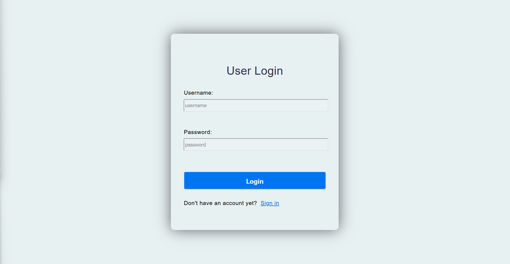
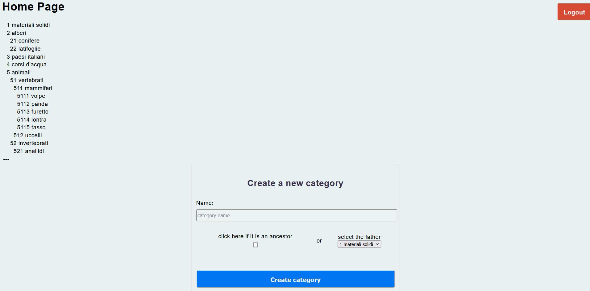
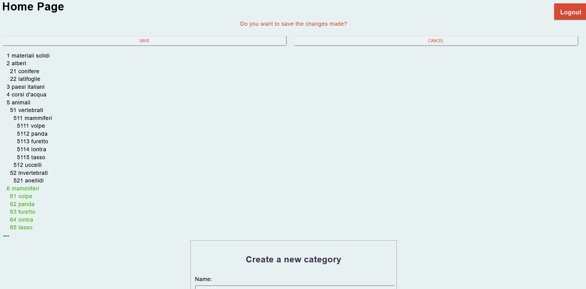
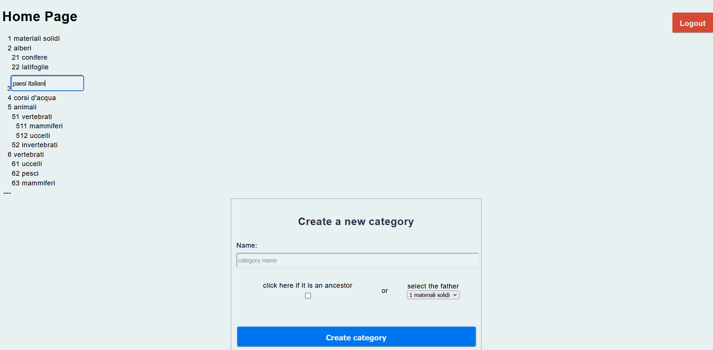

# Web-App-Project-TIW-2023 - Lo Presti Irene, Lussana Matteo
Progetto finale per il corso "Tecnologie per il Web" al politecnico di Milano. Il progetto contiene una web app in due versioni: thin e thick client. L'applicazione è stata svluppata da un gruppo composto da due persone: 
Irene Lo Presti ([@irelop](https://github.com/irelop)) e Matteo Lussana ([@matteo-lussana](https://github.com/matteo-lussana)).
# Web App
## Pure HTML
* **Login**

- **Signin**

- **HomePage**: Presenta l'albero degli elementi e la sezione Create Category nella quale è possibile creare un nuovo elemento, decidendo se è un sottoelemento di un elemento già esistente oppure se è un elemento principale

- **Clicking Copy**: Cliccando sul tasto _copy_ accanto ad un elemento verranno selezionati l'elemento e i suoi sottoelementi

- **After Copy**: Cliccando su tasto _copy here_ l'elemento e i sottoelementi selezionati verranno copiati in quel punto

## RIA
- **Copy with Drag&Drop**: Trascinando un elemento verrà copiato l'elemento stesso e i suoi sottoelementi nella posizione in cui è stato rilasciato

- **Change Name**: Cliccando su un elemento è possibile cambiarne il nome

